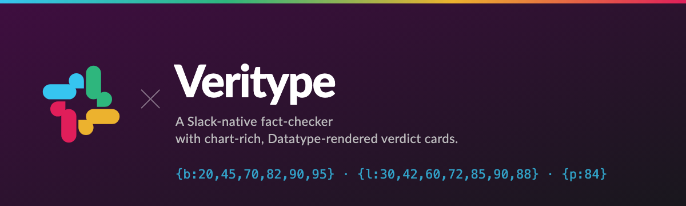
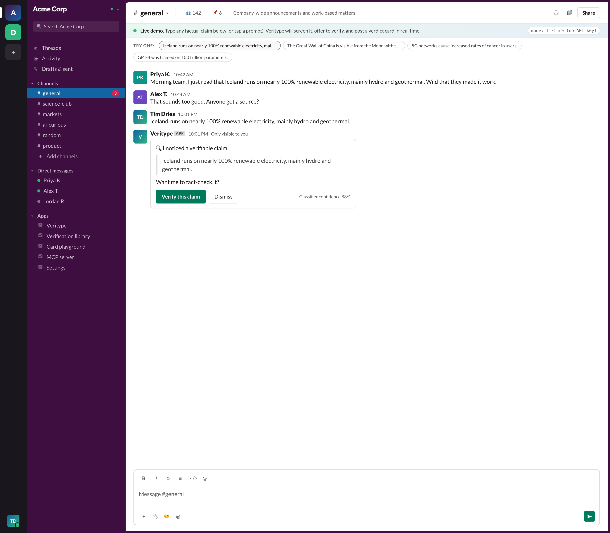
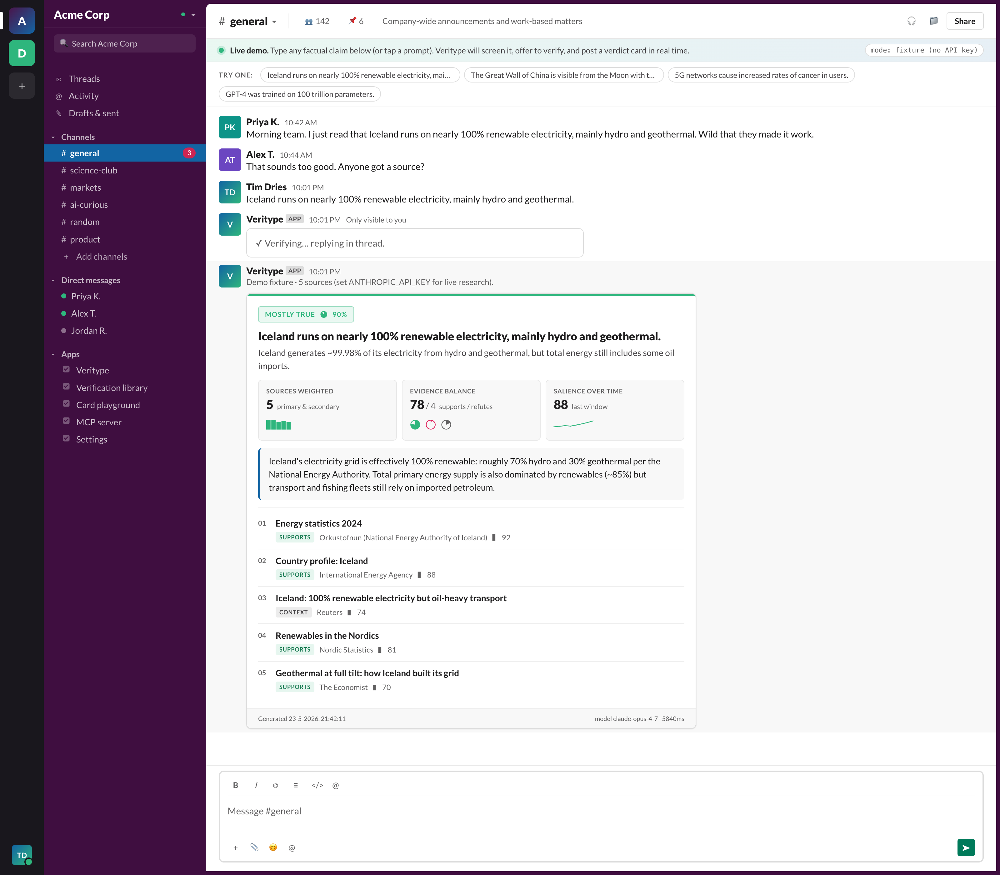
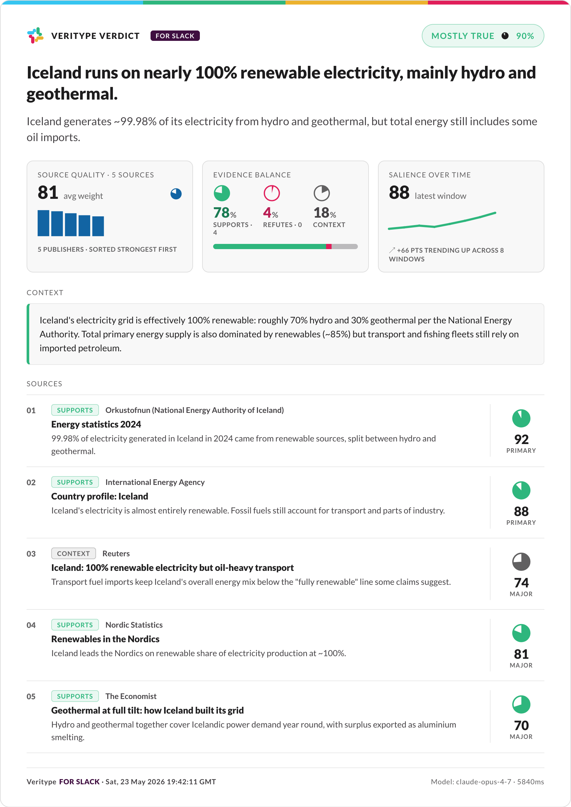
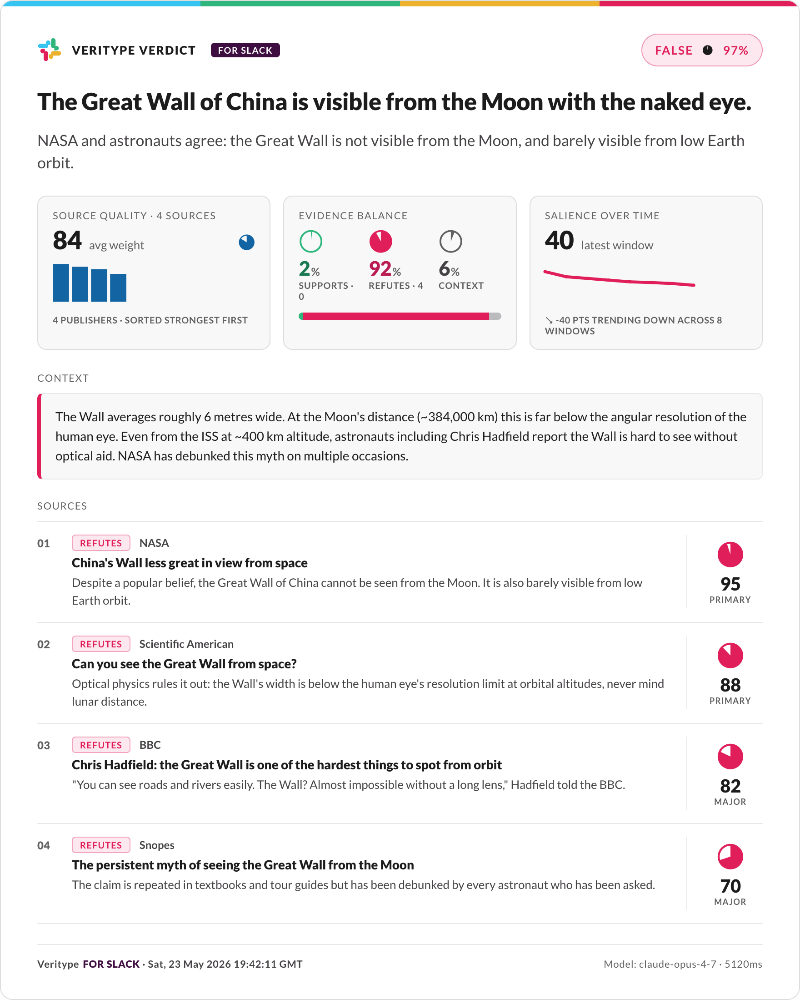
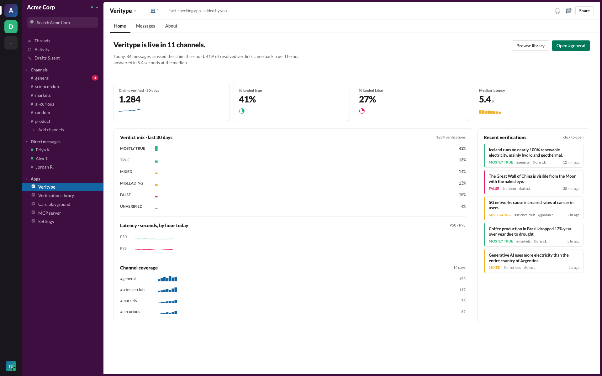
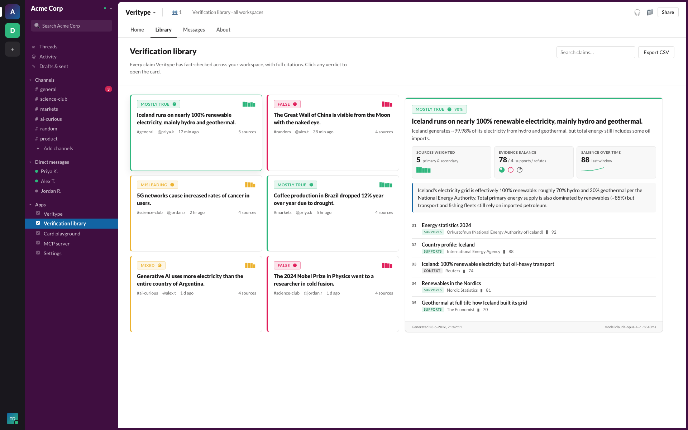
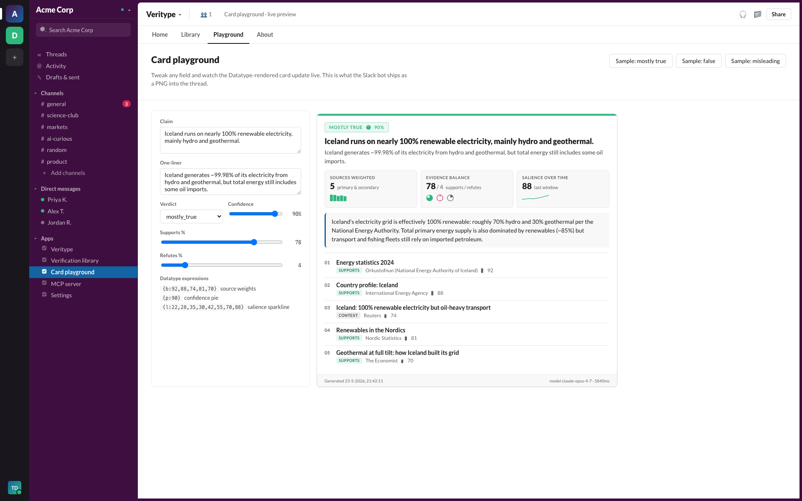
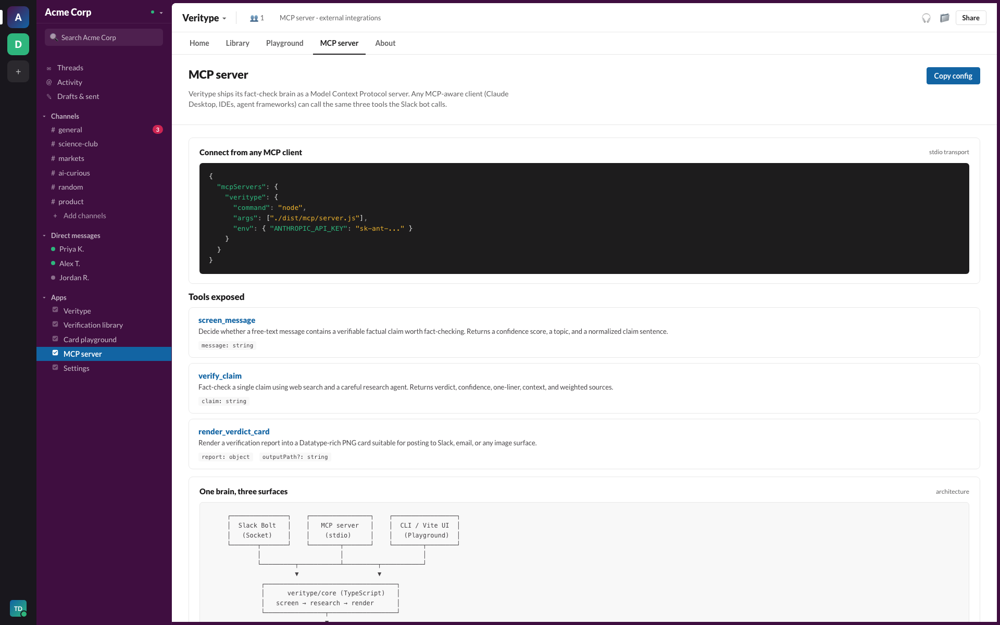
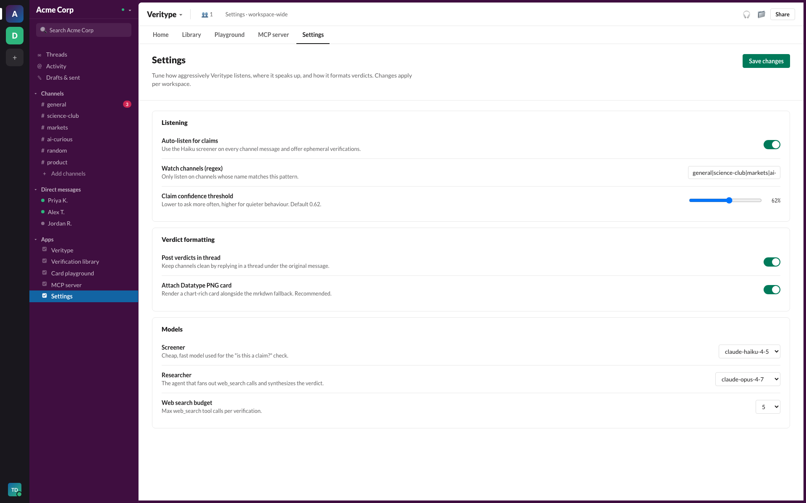

<p align="center">
  
</p>

<p align="center">
  <strong>Veritype</strong> is a Slack agent that listens for factual claims, offers to fact-check them with one tap,
  and replies in thread with a crisp, source-weighted verdict card rendered through the
  <a href="https://franktisellano.github.io/datatype/">Datatype</a> variable font.
</p>

<p align="center">
  <a href="https://youtu.be/REPLACE_WITH_DEMO_ID"><strong>📺 Watch the 3-minute demo</strong></a>
  &nbsp;·&nbsp;
  <a href="https://slackhack.devpost.com/">Slack Agent Builder Challenge</a>
  &nbsp;·&nbsp;
  Track: <strong>New Slack Agent</strong>
</p>

<p align="center">
  <a href="https://youtu.be/REPLACE_WITH_DEMO_ID">
    
  </a>
</p>

---

## Table of contents

1. [Project description](#1-project-description)
2. [Components / tech used](#2-components--tech-used)
3. [Agent type declaration](#3-agent-type-declaration)
4. [Setup instructions](#4-setup-instructions)
5. [What it looks like](#5-what-it-looks-like)

---

## 1. Project description

Slack is where modern teams trade information at high speed, and high-speed information is also how
half-true claims spread. Someone drops a stat in `#general`, three people emoji-react, and by the
afternoon it is treated as fact. Veritype closes that loop, in-channel, in seconds.

Veritype is a Slack-native fact-checking agent. It quietly listens to channels it has been invited
to, runs a fast claim-classifier over each message, and when it spots a verifiable, public-interest
claim it offers (privately to the speaker, no public noise) **"want me to fact-check that?"** One
tap fires a research agent that fans out web searches, weighs sources, and replies in thread with a
verdict card.

That verdict card is the bit that nobody else does. Veritype renders it through the
[Datatype](https://franktisellano.github.io/datatype/) OpenType variable font. Datatype turns
plain-text expressions like `{b:20,45,70,82}` into real bar charts via ligature substitution. We
use that to give every verdict three inline charts the team can read at a glance:

- `{b:…}`: a bar chart of source-quality weights (primary docs first, blogs last).
- `{p:…}`: a stack of pie charts for the support / refute / context breakdown.
- `{l:…}`: a sparkline for how the claim's salience has trended over time.

The whole card is rendered headlessly in Puppeteer and posted to Slack as an image attachment,
with a Block Kit mrkdwn fallback for screen readers, search, and threads on the mobile client.

| Today                                                       | With Veritype                                                       |
| ----------------------------------------------------------- | ------------------------------------------------------------------- |
| Claim drops in channel, no one challenges it                | Bot offers a 1-tap fact-check, privately                            |
| Person who pushes back has to Google for ten minutes        | Verdict arrives in 5 to 8 seconds with weighted citations              |
| "Source?" reply derails the thread for the rest of the day  | Card stays in thread, sources are one click away, channel stays calm |
| The team's track record on disputed claims is invisible     | Workspace dashboard tracks claims, verdicts, latency, channel coverage |

### Why this fits Slack Agent Builder Challenge

We hit **two** of the three required platform pillars:

- **MCP server integration**: Veritype's fact-check brain is exposed as a Model Context Protocol
  server (`src/mcp/server.ts`). The Slack bot is one client of it. Any other MCP-aware client
  (Claude Desktop, IDE extensions, agent frameworks) can call the same three tools.
- **Real-Time Search API**: The researcher agent uses Anthropic's `web_search_20250305` tool to
  pull and read live sources. We never invent citations.

Track: **New Slack Agent**, with the **Most Innovative** and **Best UX** awards in mind.

## 2. Components / tech used

| Component                       | Role                                                                                                  | Path                                                                                  |
| ------------------------------- | ----------------------------------------------------------------------------------------------------- | ------------------------------------------------------------------------------------- |
| Slack Bolt app                  | Socket-mode app, slash command `/verify`, message listener, button handlers                            | [src/slack/app.ts](src/slack/app.ts)                                                  |
| Slack Block Kit blocks          | Verdict block layout, mrkdwn fallback, action buttons                                                  | [src/slack/blocks.ts](src/slack/blocks.ts)                                            |
| Claim screener (Haiku)          | Triage layer that decides whether a message contains a verifiable claim                                | [src/core/screener.ts](src/core/screener.ts)                                          |
| Researcher (Opus + web_search)  | Web-search-grounded research agent that produces the verdict, confidence, and weighted sources         | [src/core/researcher.ts](src/core/researcher.ts)                                      |
| Datatype card template          | Print-perfect HTML card with Datatype font embedded for inline bar / pie / sparkline charts            | [src/core/cardTemplate.ts](src/core/cardTemplate.ts)                                  |
| Puppeteer card renderer         | Rasterizes the HTML card to a PNG suitable for posting to Slack                                        | [src/core/renderer.ts](src/core/renderer.ts)                                          |
| MCP server                      | Exposes `screen_message`, `verify_claim`, and `render_verdict_card` over stdio MCP                     | [src/mcp/server.ts](src/mcp/server.ts)                                                |
| React / Vite dashboard          | Workspace home, library, playground, MCP info, settings: all in a Slack-skinned UI for demo/screenshots | [src/web/](src/web/)                                                                  |
| Datatype font (Apache 2.0)      | The variable font that makes `{b:…}` / `{l:…}` / `{p:…}` render as inline charts                       | [assets/fonts/](assets/fonts/) · [public/fonts/](public/fonts/)                       |
| Sample fixtures                 | Three pre-baked reports (`mostly_true`, `false`, `misleading`) used by the playground and CLI renderer | [src/core/sample.ts](src/core/sample.ts)                                              |

## 3. Agent type declaration

Veritype is built as a **Coded Agent**. Everything is TypeScript: the claim screener, the
research loop, the renderer, the Slack handlers, the MCP server. There is no no-code component.

The agent runs a two-model pipeline:

- `claude-haiku-4-5`: fast, cheap classifier that screens every channel message.
- `claude-opus-4-7`: research-grade synthesizer with `web_search_20250305` enabled and a JSON
  output contract, with `claude-sonnet-4-6` as fallback.

The MCP server (`src/mcp/server.ts`) exposes the same brain to any other MCP client, so a teammate
in Claude Desktop can call `verify_claim` and get the identical, source-weighted answer the Slack
bot would deliver.

## 4. Setup instructions

### Prerequisites

- Node.js 20+
- An Anthropic API key with access to Claude Opus 4.7 + the `web_search_20250305` tool
- A Slack app in your workspace with Socket Mode enabled (instructions below)

### 1. Clone and install

```bash
git clone https://github.com/<your-org>/veritype.git
cd veritype
npm install
```

### 2. Configure environment

```bash
cp .env.example .env
```

Fill in:

- `ANTHROPIC_API_KEY`: your Anthropic key.
- `SLACK_BOT_TOKEN`: `xoxb-…` from your Slack app's OAuth & Permissions page.
- `SLACK_APP_TOKEN`: `xapp-…` from your app's Basic Information → App-Level Tokens, with the
  `connections:write` scope.
- `SLACK_SIGNING_SECRET`: your app's signing secret (Basic Information → App Credentials).

### 3. Create the Slack app

1. Go to [api.slack.com/apps](https://api.slack.com/apps) → **Create New App** → **From a
   manifest** and paste the manifest in `docs/slack-app-manifest.yaml`.
2. Enable **Socket Mode** and generate an app-level token with `connections:write`.
3. Under **OAuth & Permissions**, scopes the manifest sets for you:
   `chat:write`, `chat:write.public`, `commands`, `channels:history`, `groups:history`,
   `im:history`, `mpim:history`, `channels:read`, `users:read`.
4. Install the app to your workspace.
5. Add `/verify` as a slash command pointing to the same app (the manifest does this).

### 4. Run locally

```bash
# in one terminal
npm run dev:slack    # starts the Bolt app in Socket Mode

# in another terminal (optional, for the dashboard / screenshots)
npm run dev:web      # Vite dev server on http://127.0.0.1:5173
```

Type `/verify Iceland runs on 100% renewable electricity` in any channel the bot is a member of.
Within ~6 seconds the verdict card lands in thread.

### 5. Use as an MCP server (optional)

Build once, then point any MCP client at the bundle:

```bash
npm run build:slack   # compiles src/ → dist/
```

In `~/.claude/claude_desktop_config.json` (or any MCP client config):

```jsonc
{
  "mcpServers": {
    "veritype": {
      "command": "node",
      "args": ["/absolute/path/to/veritype/dist/mcp/server.js"],
      "env": { "ANTHROPIC_API_KEY": "sk-ant-..." }
    }
  }
}
```

The three exposed tools are `screen_message`, `verify_claim`, and `render_verdict_card`.

### 6. Render a sample card without Slack

```bash
npm run render:card -- mostly_true
# wrote docs/screenshots/sample-mostly_true.png
```

This is the fastest way to confirm the font, Puppeteer, and template are working before touching
the Slack side.

## 5. What it looks like

### Try the live demo

```bash
npm install
npm run dev:web      # opens at http://127.0.0.1:5173/?tab=stream
```

The channel stream tab is fully interactive. Type a message in the composer (or tap one of the
preset claims) and Veritype actually screens it, offers an ephemeral verification, then posts a
verdict card. With no `ANTHROPIC_API_KEY` set, the demo runs in fixture mode (still real Slack
UX, deterministic verdicts). Set the key and the same flow goes live: real Haiku 4.5 screener,
real Opus 4.7 + `web_search` research.

### In-channel: the proactive offer

Veritype screens each new message through Haiku 4.5. When it spots a verifiable, public-interest
claim, it posts an ephemeral "want me to verify this?" only the message author can see, with the
screener's confidence score for transparency.



### One tap, verdict in thread

Click "Verify this claim" and the agent fans out, weighs sources, and replies in thread with the
Datatype-rendered card. Real time. Real sources. Real verdict.



### The verdict card

One tap, a few seconds, and the bot replies in thread with a verdict card. The pill at the top
shows the verdict and a confidence pie. Three metrics below give source-weight bars, an evidence
balance (supports / refutes / context as three inline pies), and a salience sparkline. Every
source is rated, dated, stance-tagged, and links to the original.



The same template handles every verdict level: here is a false claim with a red accent and a
support/refute mix dominated by refutation:



### Workspace home

Open the Veritype app in Slack to see the workspace home. KPIs at the top track claims verified,
true/false share, and median latency, all rendered with Datatype charts. Below: verdict mix,
latency over time, channel coverage, and recent verifications.



### Verification library

Every claim Veritype has fact-checked, across every channel, with full citations. Filter by
channel, person, verdict, or just full-text search. Click a card to open the full verdict.



### Card playground

Tweak any field in a sample report and watch the Datatype card update live. This is the same
template the bot ships into Slack threads: handy for visually testing edge cases before shipping
to production.



### MCP server

The fact-check brain is also an MCP server. Drop the config into Claude Desktop and the same
three tools the Slack bot calls become available to your local Claude.



### Settings

Per-workspace tuning: auto-listen toggle, channel allow-list regex, claim threshold, model
choice, web-search budget, and verdict formatting.



---

## Repo layout

```
src/
  core/           shared brain (screener, researcher, renderer, types, samples)
  slack/          Bolt app + Block Kit blocks
  mcp/            stdio MCP server wrapping the same core
  web/            Vite + React dashboard (Slack-skinned, used for demos and screenshots)
assets/
  fonts/          Datatype woff2 (Regular / Medium / SemiBold / Bold): Apache 2.0
docs/
  screenshots/    in-app screenshots, sample verdict cards
  manual/         operator manual sources + rendered PDF
deck/             pitch deck (.pptx + .pdf)
```

## License

MIT for the code in this repo. The Datatype font (`assets/fonts/`) is Apache 2.0; see
[franktisellano/datatype](https://github.com/franktisellano/datatype) for the source.
